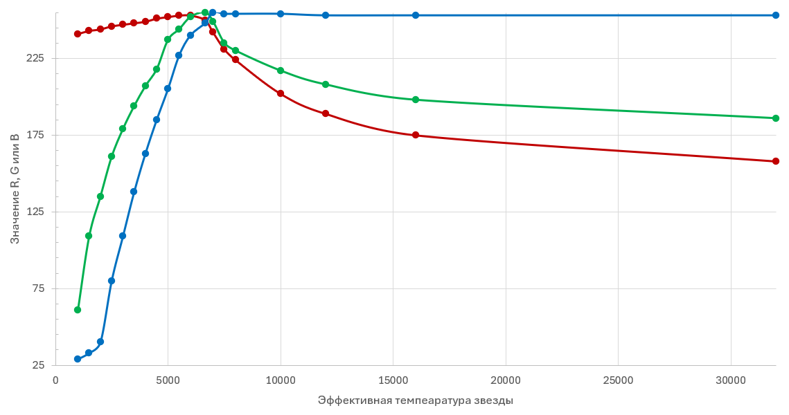

# Преобразование эффективной температуры звёзд Teff в цвет RGB: небольшая Python библиотека

## Использование
Скачиваем файл `star_colors.py`, кладём в папку своего проекта. Строка `from star_colors import *` подключает три функции.
- Функция `t2rgb(t)` принимает на входе значение эффективной температуры звезды. Выдаёт строку цвета в формате, `#RRGGBB` .
- Функция `sptype2t(sp)` принимает на входе строку обозначения спектрального класса, например `G3IV`. Выдаёт типичное для данного спектрального класса значение температуры. Работает также с редко всречающимися классами, такими, как C, S, N, W (см. описание далее).
- Функция `bv2t(bv)` принимает на вход значение показателя цвета B-V, преобразовывая его по формуле в значение эффективной температуры. Вместе с функцией `t2rgb(t)` позволяют получить цвет RGB по показателю цвета B-V.
## Тесты
Приведены исходные коды трёх тестов.
- `test_sptypes.py` выводит эффективные температуры по стандартным спектральным классам.
- `test_colorscale.py` создаёт картинку `test_colorscale.png`, показанную на этой странице с тремя цветовыми шкалами:
    - цвета звёзд спектральных классов (дискретная шкала);
    - цвета звёзд в диапазоне эффективных температур 1000 - 20000 K;
    - цвета звёзд в диапазоне показателя B-V c 3 по -0.5 .
- `test_bs_dataset.py` читает [датасет со сведениями о звёздах до 6.5m](https://github.com/dyuk108/brightstar_dataset), где приведены в том числе спектральные их классы из каталога Hipparcos. Тест показывает, что функция `sptype2t()` перевела в значения эффективных температур все обозначения спектров.
## Как это работает
Необходимость в корректном отображении цветов звёзд возникает при создании звёздных карт, диаграмм звёздной статистики и т.д. Теория вопроса есть [здесь](https://tannerhelland.com/2012/09/18/convert-temperature-rgb-algorithm-code.html), одна из реализаций на Python есть [здесь](https://github.com/brundagejoe/ColorTemperatureConverter). Мне не очень понравилась проработка цветов вблизи белого (5500 - 7000 K) - оранжевый цвет сразу переходил в белый. Но есть же откровенно жёлтые звёзды, например, система Альфа Центавра.

Посмотрев визуально на множество цветовых шкал, я нашёл, как мне кажется, [наиболее подходящую](https://upload.wikimedia.org/wikipedia/commons/8/8f/Color_temperature_black_body_radiation_logarithmic_kelvins.svg), промерил её по каналам RGB и получил следующие графики:

Получилось похоже на то, что сделали те ребята (ссылки выше). Я увидел, что они недостаточно хорошо проработали область, где кривые сходятся вверху. Особенно это касается зелёного. Скорректировал и дополнил математические функции, описывающие участки графиков.

Что касается показателя цвета B-V, то он связан с цветовой температурой формулой, упомянутой, в частности, [здесь](https://stackoverflow.com/questions/21977786/star-b-v-color-index-to-apparent-rgb-color). Это может не совпадать с эффективной температурой поверхности звезды. Во-первых, межзвёздное вещество делает звезду несколько желтее, чем она есть (тот же механизм рассеяния света, который делает делает солнце жёлтым или красным на восходе/закате). Во-вторых, это может быть необычная звезда, где особенности строения дают несколько другой цвет. Так, углеродные звёзды ярко-красные из-за избытка углерода. Поэтому цветовая температура их меньше, чем эффективная (например, 1500K вместо 3000K). Или можно привести в пример очень горячие (до 200000 К) звёзды Вольфа-Райе, которые внешне выглядят как голубые, с цветовой температурой порядка 10000 K.

Показатель показывает наблюдаемый цвет звезды. Поэтому лучше именно его использовать для обозначения цвета на звёздных картах. Функция `bv2t(bv)` превратит значение B-V в цветовую температуру, а функция `t2rgb(t)` выдаст значения цвета RGB.

Удачного использования!