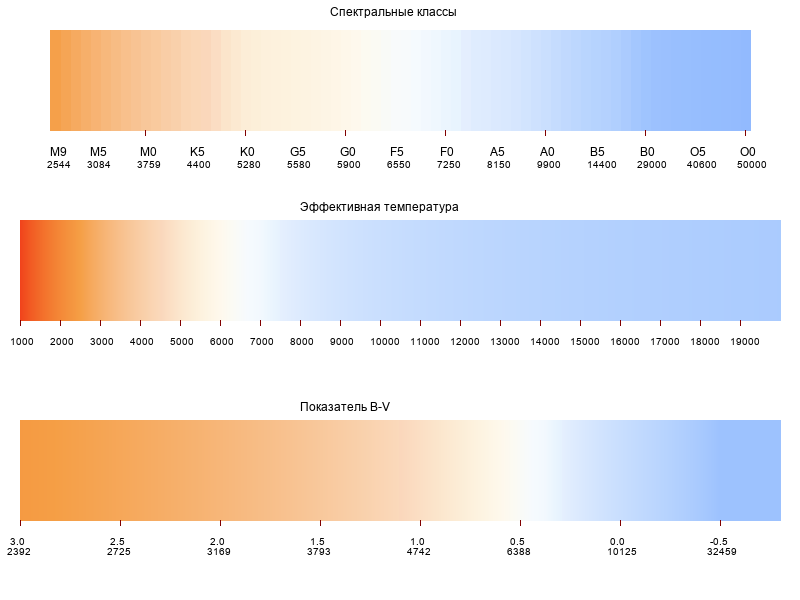

# Преобразование эффективной температуры звёзд Teff в цвет RGB: небольшая Python библиотека
## Использование

Скачиваем файл `star_colors.py`, кладём в папку своего проекта. Строка `from star_colors import *` подключает три функции.
- Функция `t2rgb(t)` принимает на входе значение эффективной температуры звезды. Выдаёт строку цвета в формате, `#RRGGBB` .
- Функция `sptype2t(sp)` принимает на входе строку обозначения спектрального класса, например `G3IV`. Выдаёт типичное для данного спектрального класса значение температуры. Работает также с редко всречающимися классами, такими, как C, S, N, W (см. описание далее).
- Функция `bv2t(bv)` принимает на вход значение показателя цвета B-V, преобразовывая его по формуле в значение эффективной температуры. Вместе с функцией `t2rgb(t)` позволяют получить цвет RGB по показателю цвета B-V.
## Тесты
Приведены исходные коды трёх тестов.
- `test_sptypes.py` выводит эффективные температуры по стандартным спектральным классам.
- `test_colorscale.py` создаёт картинку `test_colorscale.png`, показанную на этой странице с тремя цветовыми шкалами: